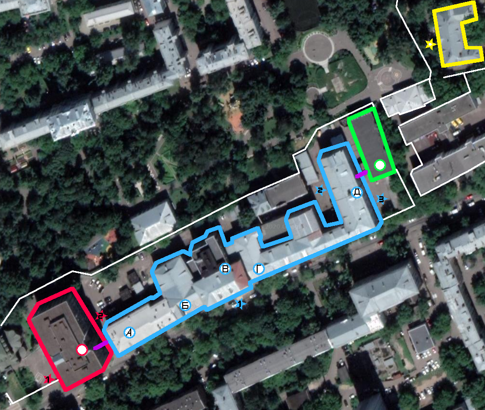
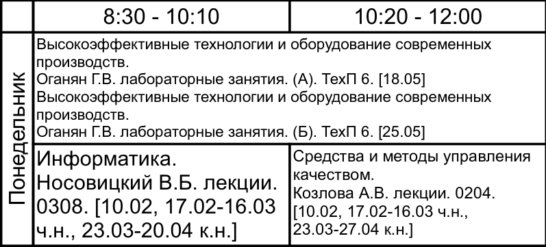

# Туториал по МГТУ СТАНКИН для студентов РиМ первого курса и всех сочувствующих

## Корпуса

В СТАНКИНе несколько корпусов:
- Новый Корпус (красное)
- Старый Корпус (синее)
- Пристройка (зеленое)
- Библиотека (желтое)
- [Фрезер](https://goo.gl/maps/X8AEcUfMZ3Cxvaej6) (не нанесен на эту карту, находится у метро Авиамоторная) (**На Фрезере тоже бывают пары**)



Звездочки - входы в корпуса; круги - лестницы; фиолетовый - переходы между корпусами.

В Новом Корпусе все этажи соединены единой лестницей.
В Старом корпусе в порядке с запада на восток:
```
- лестница А между первым и вторым этажом, ведет к переходу (на втором этаже) в Новый корпус и кафедре русского языка
- лестница Б между первым и четвертым этажом
    1. тп 5-а, проход на запад (к А) и на восток (к В)
    2. кусок деканата, проход на восток (к В)
    3. КЛУБ, спортзал, кафедра метрологии, проход на восток (к В)
    4. Какая-та ненужная робототехникам кафедра
- лестница В между первым и пятым этажом, центральная
    1. вход в старый корпус, проходы на запад (к Б) и на восток (к Г)
    2. столовая, кусок деканата, проходы на запад (к Б) и на восток (к Г)
    2.5 кафедра математики
    3. столовая, кафедра метрологии, проход на запад (к Б)
    4. кафедра теоретической механики, территория ФЭМа
    5. территория ФЭМа
- лестница Г между первым и четвертым этажом, проход на третий и четвертый этажи закрыт
    1. технологический полигон, часть не для робототехников, проход на запад (к В) и на восток к выходу на внутреннюю территорию
    2. аквариумы, проход на запад (к В) и на восток (к Д)
    3. бывшая кафедра иностранного языка, кафедра инженерной графики (доступна от Д)
    4. частично бывшая кафедра физики (доступна от Д)
- лестница Д между подвалом и четвертым этажом
    0. подвал
    1. технологический полигон, часть для робототехников, проход на восток к выходу на внутреннюю территорию
    2. кафедра робототехники и мехатроники, кафедра химии, проход на восток (к Г)
    3. кафедра электротехники, проход на восток (к кафедрам инженерной графики и бывшей кафедре иностранного языка), проход на запад в пристройку (через дверь с пинпадом у кафедры электротехники, пинпад отключен)
    4. проход к кафедре физики
```

Стоит понимать что в СТАНКИНе есть четыре третьих этажа, один в Новом Корпусе, два в Старом Корпусе и один в Пристройке.
Нумерация третьего этажа Старого Корпуса сквозная.

## Нумерация аудиторий

Номера аудиторий Нового Корпуса начинаются с `0` и содержат четыре цифры.
Номера аудиторий Старого Корпуса содержат три цифры.
Третья с конца цифра указывает этаж, последние две цифры - номер аудитории на этаже.

Пример: `0204` - Новый Корпус, второй этаж, четвертая аудитория; `334` - Старый Корпус, третий этаж, тридцать четвертая аудитория.

## Модули, зачеты, экзамены

В учебной системе СТАНКИНа есть `модули`, `зачеты` и `экзамены`.
В семестре два модуля, в середине и в конце семестра.
Каждый предмет в семестре будет иметь два модуля и либо экзамен, либо зачет.
Чтобы быть допущенным к экзамену по предмету нужно:
- получить модули по `этому` предмету
- закрыть зачеты по `другим` предметам
- выполнить дополнительно оговоренные условия (например, сделать курсовую)

Чтобы быть допущенным к зачету по предмету нужно:
- получить модули по `этому` предмету
- выполнить дополнительно оговоренные условия

Чтобы получить модуль по предмету нужно выполнить заранее оговоренные преподавателем условия в заданный срок (до конца модульной недели). Если условия выполнены с опозданием, то оценка за модуль может быть автоматически урезана деканатом.
На самом деле правила допуска до экзаменов чуть сложнее и зависят от решения деканата, но в первом приближении они похожи на вышеописанные.

## Оценки

Система оценок: засчитываема оценка лежит в диапазоне `[25; 54]`, где `25` — "с трудом удовлетворительно", `50` — "отлично", `54` — "вышедшая за пределы отличного работа" (например, выдающаяся самостоятельная работа по профилю).
На обычную шкалу пересчитывается через деление на десять. Так `45 -> 5-` (отлично с минусом), а `44 -> 4+` (хорошо с плюсом).

В некоторых случаях можно получить оценку выше `54`, например за олимпиады.

## Рейтинг

Оценки влияют на `рейтинг`. Рейтинг, в свою очередь, влияет на размер стипендии, получаемой студентом со второго семестра. Разные предметы имеют разные веса во влиянии на рейтинг.
На первом семестре студенты получают априорную стипендию.

## Расписание

Расписание зависит от группы. По вертикали отложены дни, по горизонтали - пары.
В ячейке указывается предмет, тип занятия, преподаватель, аудитория, даты.

Пример чтения расписания:


В понедельник на первой паре (`8:30 - 10:10`) в этом примере может быть:
- ВТО под руководством Оганяна Г.В. Это лабораторная подгруппы А, в аудитории Технологического Полигона №6, произойдет 18го числа 5го месяца
- ВТО под руководством Оганяна Г.В. Это лабораторная подгруппы Б, в аудитории Технологического Полигона №6, произойдет 25го числа 5го месяца
- Информатика под руководством Носовицкого В.Б., лекция в аудитории 0308 (новый корпус), будет 10го числа второго месяца, с 17го числа 2го месяца по 16 число 3го месяца раз в две недели, потом с 23го числа 3го месяца по 20е число 4го месяца каждую неделю.

## Расположение туалетов:

Новый Корпус:
- со второго этажа и выше есть этажи с туалетами.

Старый Корпус:
- Мужские:
    - Лестница Б, первый этаж
    - Лестница Д, третий этаж
    - Лестница Д, четвертый этаж
- Женские:
    - Лестница Б, второй этаж
    - Лестница Д, второй этаж
    - Лестница Д, третий этаж
Возможно я уже подзабыл и путаю.

## Проходы между Старым и Новым корпусами

- Через второй этаж (лестница А в Старом Корпусе)
- Через проход синий 1 вдоль Вадковского переулка до входа красный 1
- Через проход синий 2 по заднему двору до входа красный 2
- Через проход синий 3 по заднему двору до входа красный 2

## Пристройка
В Пристройке (проход от лестницы Д на третьем этаже) находятся:
1. Метрологическая лаборатория
2. Типография
3. Кафедра Компьютерных Систем Управления

## Структура

В университете СТАНКИН четыре института:
- Институт Машиностроения и Инжиниринга
- Институт Автоматизации и Робототехники
- Институт Информационных Систем и Технологий
- Институт Экономики и Технологического Менеджмента

## Лабораторные

Лабораторные обязательны для посещения. Пропуск лабораторной может сломать жизнь студента.

Студент! Если ты пропустил лабораторную - бегом к преподавателю (до следующей лабораторной) со справкой, возможно будет шанс отработать с другой группой.

## Сессия

К сессии студент должен получить все модули (в идеальном случае).
На время сессии студент получает зачетную книжку.
Зачетную книжку необходимо сдать в деканат сразу по завершению сессии.
